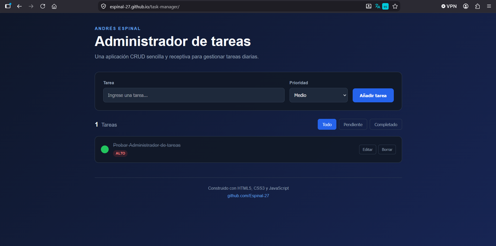

# Task Manager — CRUD Web Application

A responsive task management web application built with HTML5, CSS3 and JavaScript.

The application allows users to create, edit, complete, delete and filter tasks while automatically saving information in the browser using LocalStorage.

## Live Demo

https://espinal-27.github.io/task-manager/

## Preview

<p align="center">
  
</p>

## Features

- Create new tasks
- Edit existing tasks
- Mark tasks as completed
- Delete tasks
- Filter tasks by status
- Assign task priority
- Persistent data using LocalStorage
- Responsive design
- Clean and modern interface
- Client-side input handling

## Technologies

- HTML5
- CSS3
- JavaScript
- DOM Manipulation
- LocalStorage
- Responsive Web Design

## Project Structure

```text
task-manager/
│
├── index.html
├── style.css
├── script.js
└── README.md
